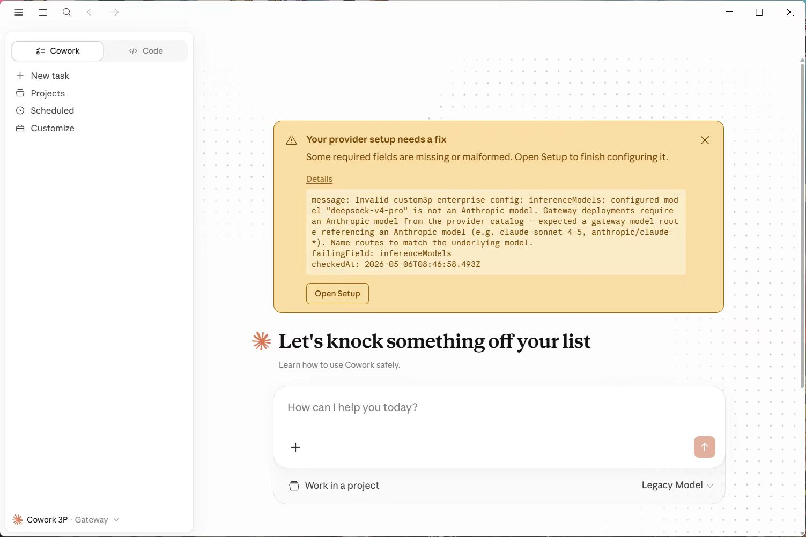
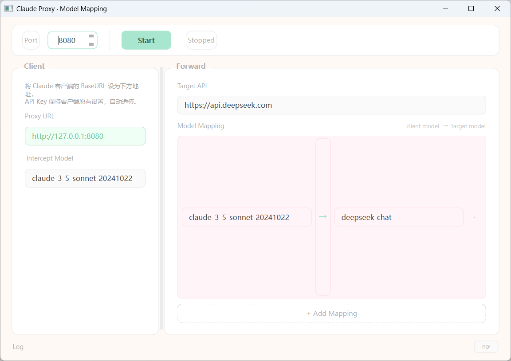

# Claude Proxy — 本地反向代理 · 模型名映射工具

<p align="center">
  
  
  
  
  
</p>

一个基于 Tauri 2 + React 的本地反向代理工具，用于拦截 Claude 桌面客户端的 API 请求，将模型名称动态替换后转发至第三方 API，并以 SSE 流式方式透传响应。

---

## 目录

- [它能做什么](#它能做什么)
- [工作原理](#工作原理)
- [项目结构](#项目结构)
- [环境要求](#环境要求)
- [开发与运行](#开发与运行)
- [在 Claude 桌面端中使用](#在-claude-桌面端中使用)
- [构建与打包](#构建与打包)
- [GitHub Actions 自动发布](#github-actions-自动发布)
- [常见问题](#常见问题)
- [License](#license)

---

## 它能做什么

Claude 桌面客户端会对请求中的模型名称进行校验，只允许官方模型名（如 `claude-3-5-sonnet-20241022`）。直接使用第三方 API 会提示连接失败：

<p align="center">
  
</p>


本工具在本地启动一个 HTTP 代理服务，解决上述问题：

1. **拦截请求** — 监听本地端口，接收 Claude 客户端发出的 API 请求
2. **替换模型名** — 将 JSON Body 中的 `model` 字段按映射规则替换为目标模型名
3. **透传 API Key** — 客户端携带的 `Authorization` 头原样转发，无需手动配置密钥
4. **流式转发** — 支持 SSE（Server-Sent Events）实时透传，保留打字机效果
5. **跨平台** — 一套代码，Windows / macOS / Linux 三平台原生运行

---

## 工作原理

```
┌──────────────────┐         ┌───────────────────────┐         ┌──────────────────┐
│                  │  HTTP    │                       │  HTTP    │                  │
│  Claude Desktop  │ ──────→ │   本地代理 (本工具)     │ ──────→ │  第三方 API       │
│  Client          │         │   127.0.0.1:8080      │         │  (DeepSeek, etc.) │
│                  │ ←────── │                       │ ←────── │                  │
└──────────────────┘  SSE    │  model: A → B          │  SSE    └──────────────────┘
                             │  auth: 原样透传         │
                             └───────────────────────┘
```

### 请求流程

1. Claude 客户端将 BaseURL 指向 `http://127.0.0.1:8080`，发出 POST 请求（通常为 `/v1/messages`）
2. 代理服务（axum）接收请求，解析 HTTP 头部和 JSON Body
3. 查找模型映射表，将 `model` 字段从客户端模型名替换为目标模型名
4. 将客户端的 `Authorization` 头原样保留，连同修改后的请求一起转发至真实 API
5. 收到第三方 API 的 SSE 流式响应后，通过 reqwest streaming 实时透传回客户端

### 技术栈

| 层 | 技术 | 职责 |
|---|---|---|
| 前端 | React 19 + Vite | UI 界面、用户交互、日志展示 |
| 通信 | Tauri IPC (`invoke` / `listen`) | 前端调用 Rust 命令、接收实时日志 |
| 后端 | Rust + axum + reqwest | HTTP 代理、请求解析、模型名替换、SSE 流式转发 |

---

## 项目结构

```
LRP_MNM/
├── index.html                  # HTML 入口
├── package.json                # Node.js 依赖与脚本
├── vite.config.js              # Vite 构建配置
├── src/
│   ├── main.jsx                # React 入口
│   ├── App.jsx                 # 主界面组件
│   └── App.css                 # 马卡龙浅色样式
├── src-tauri/
│   ├── Cargo.toml              # Rust 依赖
│   ├── tauri.conf.json         # Tauri 配置（窗口、打包）
│   ├── build.rs                # Tauri 构建脚本
│   ├── src/
│   │   ├── main.rs             # Rust 入口
│   │   ├── lib.rs              # Tauri Builder 注册
│   │   ├── proxy.rs            # 代理服务器核心逻辑
│   │   └── commands.rs         # Tauri 命令层
│   ├── capabilities/
│   │   └── default.json        # 权限配置
│   └── icons/                  # 应用图标
└── .github/
    └── workflows/
        └── build.yml           # GitHub Actions CI/CD
```

| 文件 | 职责 |
|------|------|
| `proxy.rs` | axum 监听、HTTP 解析、模型名替换、reqwest 转发、SSE 流式透传 |
| `commands.rs` | Tauri 命令（start_proxy / stop_proxy / get_status / get_log_buffer） |
| `lib.rs` | 注册命令、管理全局代理状态 |
| `App.jsx` | 界面布局、配置面板、映射管理、日志展示 |

---

## 环境要求

- **Node.js** 18+（推荐 20 LTS）
- **Rust** 1.77+（[安装](https://rustup.rs/)）
- **系统依赖**（仅 Linux）：

```bash
sudo apt install libwebkit2gtk-4.1-dev libappindicator3-dev librsvg2-dev patchelf
```

---

## 开发与运行

### 安装依赖

```bash
# 安装前端依赖
npm install
```

### 开发模式

```bash
npm run tauri dev
```

启动后会打开一个原生窗口，前端支持热更新，Rust 代码修改后会自动重新编译。

### 生产构建

```bash
npm run tauri build
```

构建产物在 `src-tauri/target/release/bundle/` 下：
- Windows: `.msi` + `.exe` 安装包
- macOS: `.dmg`
- Linux: `.deb` + `.AppImage`

---

## 在 Claude 桌面端中使用

### 第 1 步：启动代理

运行本工具，在顶部控制栏中：
- 设置端口（默认 `8080`）
- 点击 **Start** 启动代理
- 状态栏显示 `Running · port 8080` 表示启动成功

### 第 2 步：配置代理转发

在右侧面板中：
- **Target API** — 填入第三方 API 地址，如 `https://api.deepseek.com`
- **Model Mapping** — 添加映射规则：
  - 左侧填 Claude 客户端会发送的模型名（如 `claude-3-5-sonnet-20241022`）
  - 右侧填你实际想调用的模型名（如 `deepseek-chat`）
- 支持添加多条映射规则

### 第 3 步：配置 Claude 客户端

打开 Claude 桌面客户端设置，选择 **Use custom API base URL**，填入代理地址：

<p align="center">
  
</p>


| 配置项 | 填写内容 |
|--------|---------|
| API Base URL | `http://127.0.0.1:8080` |
| API Key | 保持你自己的 Key 不变（会自动透传给第三方 API） |
| Model | 选择任意官方模型名（会被代理自动替换） |

### 第 4 步：正常使用

配置完成后正常使用 Claude 即可。代理会自动拦截请求、替换模型名、转发至第三方 API 并流式透传响应。

底部日志区可查看每次请求的模型映射和响应状态，点击 **Hide** 可收起日志。

---

## 构建与打包

Tauri 内置跨平台打包能力，一条命令即可生成安装包：

```bash
npm run tauri build
```

| 平台 | 产出格式 | 产出位置 |
|------|---------|---------|
| Windows | `.msi` + `.exe` | `src-tauri/target/release/bundle/msi/` |
| macOS | `.dmg` | `src-tauri/target/release/bundle/dmg/` |
| Linux | `.deb` / `.AppImage` | `src-tauri/target/release/bundle/deb/` |

无需手动收集依赖，Tauri 自动处理。

---

## GitHub Actions 自动发布

项目已配置 GitHub Actions，**推送到 main 分支即自动构建并发布**：

```bash
git add .
git commit -m "release: v1.0.0"
git push
```

Actions 会自动完成：
1. 从 `tauri.conf.json` 读取版本号
2. 自动创建 git 标签（如 `v1.0.0`）
3. 在 Windows / macOS / Linux 三平台并行构建
4. 将安装包上传至 GitHub Releases 页面

你可以在仓库的 [Releases](../../releases) 页面直接下载对应平台的安装包。

---

## 常见问题

### Q: 启动代理后 Claude 客户端无法连接？

确认 Claude 客户端中的 BaseURL 已正确设置为 `http://127.0.0.1:8080`（注意是 `http` 不是 `https`）。

### Q: 提示端口被占用？

更换一个未被占用的端口号（如 8081、9090 等），然后重启代理。

### Q: 请求转发成功但模型没有被替换？

检查右侧面板的映射规则，确保"客户端模型名"与 Claude 实际发送的模型名完全一致（区分大小写）。

### Q: SSE 流式响应卡顿？

本工具使用 reqwest streaming 逐块转发，正常情况下不会有卡顿。如果出现卡顿，检查网络连接是否稳定。

### Q: API Key 安全吗？

本工具不会存储或修改 API Key，客户端携带的 `Authorization` 头会原样透传给第三方 API。

### Q: macOS 提示"无法打开，因为无法验证开发者"？

前往 `系统设置 → 隐私与安全性`，点击"仍要打开"即可。

---

## License

MIT License

---

> 如果这个项目对你有帮助，欢迎 Star
